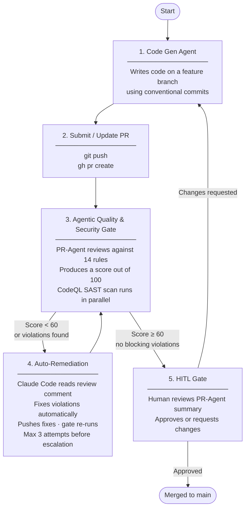

# Agentic SDLC Pipeline Template

A GitHub repository template that enforces code quality and security standards on pull requests submitted by AI agents. Clone it, run `terraform apply`, and you have a fully configured pipeline — no click-ops required.

---

## What this template gives you

| Component | What it does |
|-----------|-------------|
| **PR-Agent quality gate** | AI code review on every PR, scored /100. Gate fails if score < 60. |
| **Auto-remediation** | When the gate fails, Claude Code fixes violations automatically and pushes. Up to 3 attempts before escalating. |
| **CodeQL SAST** | Static analysis on every PR and weekly. Results in the Security tab. |
| **Dependabot** | Weekly PRs for outdated npm packages and GitHub Actions. Security updates fire immediately on CVE discovery. |
| **Secret scanning** | Blocks commits containing detected secrets. |
| **Branch protection** | Requires PR before merging. Requires conversation resolution. |
| **14 gatekeeper rules** | 6 quality rules + 8 OWASP security rules — tuned for AI agent failure modes. |
| **CLAUDE.md** | Claude Code reads this at session start — tells the agent the full workflow, commit format, and all rules. |
| **Terraform IaC** | Configures all GitHub settings from a single `terraform apply`. |

---

## How it works



The human at step 5 only sees PRs the automation has already signed off on.

---

## Getting started

### Prerequisites

- [Terraform](https://developer.hashicorp.com/terraform/install) >= 1.5
- [GitHub CLI](https://cli.github.com/) (`gh auth login`)
- A GitHub personal access token with `repo`, `admin:repo_hook`, and `read:org` scopes
- An [Anthropic API key](https://console.anthropic.com/)

### Steps

**1. Create a new repo from this template**

Click **Use this template** on GitHub, or clone directly:

```bash
git clone https://github.com/alisonbutcher/pr-agent-testing my-project
cd my-project
```

**2. Configure Terraform**

```bash
cd terraform
cp terraform.tfvars.example terraform.tfvars
```

Edit `terraform.tfvars`:

```hcl
github_token           = "ghp_..."
github_owner           = "your-username-or-org"
repository_name        = "my-project"
repository_description = "Short description"
anthropic_api_key      = "sk-ant-api03-..."
```

**3. Apply**

```bash
terraform init
terraform apply
```

**4. Push to your new repo**

```bash
cd ..
git remote set-url origin git@github.com:<your-owner>/my-project.git
git push -u origin main
```

The full pipeline is live. Open a PR to see it in action.

### What Terraform configures

| Setting | Value |
|---------|-------|
| Repository visibility | Public |
| Merge strategy | Squash only, delete branch on merge |
| Dependabot vulnerability alerts | Enabled |
| Secret scanning + push protection | Enabled |
| Branch ruleset | Requires PR before merging to main |
| Conversation resolution | Required before merge |
| `ANTHROPIC_API_KEY` Actions secret | Set from `terraform.tfvars` |
| `QUALITY_GATE_MIN_SCORE` Actions variable | 60 (adjustable) |
| `PR_AGENT_MODEL` Actions variable | `anthropic/claude-sonnet-4-6` |
| `PR_AGENT_FALLBACK_MODEL` Actions variable | `anthropic/claude-haiku-4-5-20251001` |

---

## Configuration

### Adjusting the quality gate threshold

Defaults to 60/100. Minor violations (a couple of `console.log` calls) may still score above 60 — raise the threshold if you want stricter enforcement.

```hcl
# terraform.tfvars
quality_gate_min_score = 75
```

```bash
cd terraform && terraform apply
```

### Changing the AI model

```hcl
pr_agent_model          = "anthropic/claude-opus-4-8"
pr_agent_fallback_model = "anthropic/claude-haiku-4-5-20251001"
```

### Editing gatekeeper rules

Rules are in `.pr_agent.toml`. Edit `extra_instructions`, commit, and merge to `main` — PR-Agent always reads config from the base branch.

---

## Gatekeeper rules

### Quality

| Rule | What triggers it |
|------|-----------------|
| Coupling | Direct DB queries or raw cloud SDK imports in frontend components |
| Error handling | Silent `catch` blocks that swallow errors without logging |
| Test tampering | Modifying `*.test.ts` files alongside application code |
| Type safety | `any` types in TypeScript |
| Debug artifacts | `console.log`, `console.warn`, or `console.error` in production code |
| Hardcoded values | Hardcoded URLs, endpoints, or credentials |

### Security (OWASP Top 10)

| Rule | What triggers it |
|------|-----------------|
| Injection | Raw SQL string concatenation |
| XSS | `dangerouslySetInnerHTML`, `innerHTML`, or `eval()` with user-controlled data |
| Insecure deserialization | `JSON.parse` on external data without schema validation |
| Dependency confusion | Imports of packages absent from `package.json` |
| Path traversal | File system ops with user-supplied paths |
| Secrets in code | Strings resembling API keys or tokens (`sk-`, `Bearer `, `password =`) |
| Prototype pollution | Assignments to `__proto__` or `constructor.prototype` |
| SSRF | HTTP calls where the URL is built from user-controlled input |

---

## Auto-remediation

When the gate fails, `auto-remediate.yml` triggers automatically:

1. Fetches the PR-Agent review comment
2. Runs Claude Code non-interactively with the review feedback as context
3. Claude Code reads the flagged files, fixes violations, and pushes a new commit
4. The gate re-runs

After **3 failed attempts** the workflow stops and posts a comment escalating to human review.

### What auto-remediation handles well

| Fixes reliably | Needs human |
|----------------|-------------|
| Silent catch blocks | Architectural violations |
| `console.log` in production | Logic bugs requiring domain knowledge |
| `any` types in TypeScript | Violations in test files (forbidden by rules) |
| Hardcoded values → env vars | Conflicting requirements |

---

## Working with Claude Code

`CLAUDE.md` is read automatically by Claude Code at the start of every session. It covers the full workflow, conventional commit format, and all 14 gatekeeper rules — so the agent knows what to avoid before writing a line of code.

No extra prompting needed. Open a Claude Code session in the repo and it follows the pipeline.

---

## Commit and PR format

All commits and PR titles must follow [Conventional Commits](https://www.conventionalcommits.org/):

```
<type>: <short description>
```

| Type | When |
|------|------|
| `feat:` | New functionality |
| `fix:` | Bug fix |
| `chore:` | Tooling, config, dependencies |
| `docs:` | Documentation only |
| `refactor:` | Restructuring with no behaviour change |
| `test:` | Adding or updating tests |
| `perf:` | Performance improvement |
| `ci:` | CI/CD changes |

---

## Repository structure

```
.github/
  workflows/
    agentic-gate.yml        # PR-Agent quality gate + score enforcement
    auto-remediate.yml      # Triggered on gate failure — Claude Code fixes violations
    codeql.yml              # CodeQL SAST — runs on PRs and weekly
  dependabot.yml            # Weekly dependency + Actions updates
  pull_request_template.md  # Checklist shown when opening a PR
.pr_agent.toml              # Gatekeeper rules and PR-Agent config
CLAUDE.md                   # Agent operating manual
terraform/
  main.tf                   # Provider config
  variables.tf              # All configurable inputs
  repository.tf             # Repo settings and security features
  branch_protection.tf      # Branch ruleset and conversation resolution
  secrets.tf                # Actions secrets and variables
  outputs.tf                # Repo URL and clone URL
  terraform.tfvars.example  # Copy this to terraform.tfvars to get started
```

---

## Security

- Secrets stored as GitHub Actions secrets, never in code
- Push protection blocks commits containing detected secrets
- CodeQL runs on every PR and weekly — findings appear in the Security tab
- Dependabot opens PRs for vulnerable dependencies automatically
