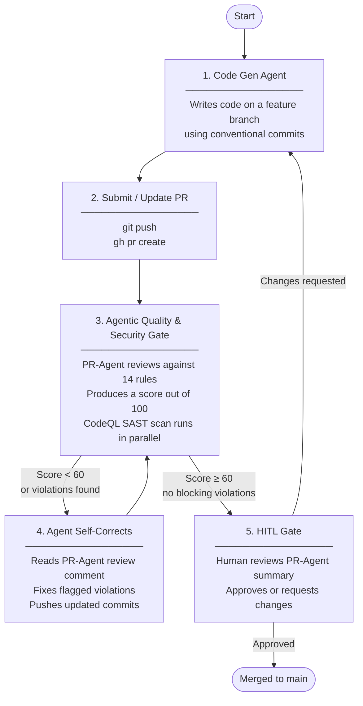

# Agentic SDLC Pipeline

A reusable GitHub repository template that enforces code quality and security standards on pull requests submitted by AI agents. It combines PR-Agent AI review, a numeric quality gate, CodeQL SAST scanning, Dependabot dependency management, and branch protection — all bootstrapped via Terraform with no manual click-ops.

---

## How it works



The self-correction loop between steps 3 and 4 is driven by `CLAUDE.md` — the agent reads PR-Agent's review comment directly from the PR and iterates without human involvement until the gate passes.

---

## Bootstrapping a new project

### Prerequisites

- [Terraform](https://developer.hashicorp.com/terraform/install) >= 1.5
- [GitHub CLI](https://cli.github.com/) authenticated (`gh auth login`)
- A GitHub personal access token with `repo`, `admin:repo_hook`, and `read:org` scopes
- An Anthropic API key

### Steps

```bash
# 1. Clone this repo as the starting point for your new project
git clone https://github.com/alisonbutcher/pr-agent-testing my-new-project
cd my-new-project

# 2. Configure Terraform variables
cd terraform
cp terraform.tfvars.example terraform.tfvars
```

Edit `terraform.tfvars`:

```hcl
github_token           = "ghp_..."
github_owner           = "your-username-or-org"
repository_name        = "my-new-project"
repository_description = "Short description of your project"
anthropic_api_key      = "sk-ant-api03-..."
```

```bash
# 3. Apply — creates the repo and configures all settings
terraform init
terraform apply

# 4. Push the repo files to the newly created GitHub repo
cd ..
git remote set-url origin git@github.com:<your-owner>/my-new-project.git
git push -u origin main
```

That's it. The full pipeline is live.

### What Terraform configures

| Setting | Value |
|---------|-------|
| Repository visibility | Public |
| Merge strategy | Squash only, delete branch on merge |
| Dependabot vulnerability alerts | Enabled |
| Secret scanning | Enabled |
| Push protection | Enabled |
| Branch ruleset | Requires PR before merging to main |
| Conversation resolution | Required before merge |
| `ANTHROPIC_API_KEY` Actions secret | Set from `terraform.tfvars` |
| `QUALITY_GATE_MIN_SCORE` Actions variable | 60 (adjustable) |
| `PR_AGENT_MODEL` Actions variable | `anthropic/claude-sonnet-4-6` |
| `PR_AGENT_FALLBACK_MODEL` Actions variable | `anthropic/claude-haiku-4-5-20251001` |

---

## Configuration

### Adjusting the quality gate threshold

The minimum passing score defaults to 60/100. To change it, update `terraform.tfvars` and re-apply:

```hcl
quality_gate_min_score = 75
```

```bash
cd terraform && terraform apply
```

### Changing the AI model

```hcl
pr_agent_model          = "anthropic/claude-opus-4-8"
pr_agent_fallback_model = "anthropic/claude-haiku-4-5-20251001"
```

### Editing gatekeeper rules

Rules are defined in `.pr_agent.toml`. Edit `extra_instructions` to add, remove, or reword rules, then commit and merge to `main` — PR-Agent always reads config from the base branch.

---

## Gatekeeper rules

PR-Agent reviews every PR against 14 rules. Violations reduce the score; enough violations fail the gate.

### Quality rules

| Rule | Description |
|------|-------------|
| Coupling | No direct DB queries or raw cloud SDK imports in frontend components |
| Error handling | No silent `catch` blocks — exceptions must be logged |
| Test tampering | Agents may not modify `*.test.ts` files alongside application code |
| Type safety | No `any` types in TypeScript |
| Debug artifacts | No `console.log/warn/error` in production code |
| Hardcoded values | No hardcoded URLs, endpoints, or credentials |

### Security rules (OWASP Top 10)

| Rule | Description |
|------|-------------|
| Injection | No raw SQL string concatenation — use parameterised queries or an ORM |
| XSS | No `dangerouslySetInnerHTML`, `innerHTML`, or `eval()` with user-controlled data |
| Insecure deserialization | No `JSON.parse` on external data without schema validation |
| Dependency confusion | No imports of packages absent from `package.json` |
| Path traversal | No file system ops with user-supplied paths |
| Secrets in code | No strings resembling API keys or tokens |
| Prototype pollution | No assignments to `__proto__` or `constructor.prototype` |
| SSRF | No HTTP calls where the URL is built from user input |

---

## Working with Claude Code

This repo includes a `CLAUDE.md` file that Claude Code reads automatically at the start of every session. It tells the agent:

- Always work on a feature branch
- Use conventional commit messages (`feat:`, `fix:`, `chore:`, etc.)
- Open a PR and wait for the quality gate
- If the gate fails, read the PR-Agent review comment and fix the violations before pushing again

No extra prompting is needed — open a Claude Code session in this repo and it will follow the pipeline.

---

## Commit and PR message format

All commits and PR titles must follow [Conventional Commits](https://www.conventionalcommits.org/):

```
<type>: <short description>
```

| Type | When to use |
|------|------------|
| `feat:` | New functionality |
| `fix:` | Bug fix |
| `chore:` | Tooling, config, dependencies |
| `docs:` | Documentation only |
| `refactor:` | Restructuring with no behaviour change |
| `test:` | Adding or updating tests |
| `perf:` | Performance improvement |
| `ci:` | CI/CD changes |

---

## Repository structure

```
.github/
  workflows/
    agentic-gate.yml        # PR-Agent quality gate + score enforcement
    codeql.yml              # CodeQL SAST — runs on PRs and weekly
  dependabot.yml            # Weekly dependency updates (npm + Actions)
  pull_request_template.md  # Checklist shown when opening a PR
.pr_agent.toml              # Gatekeeper rules and PR-Agent config
CLAUDE.md                   # Agent operating manual (read by Claude Code)
terraform/
  main.tf                   # Provider config
  variables.tf              # All configurable inputs
  repository.tf             # Repo settings and security features
  branch_protection.tf      # Branch ruleset and conversation resolution
  secrets.tf                # Actions secrets and variables
  outputs.tf                # Repo URL and clone URL
  terraform.tfvars.example  # Copy this to terraform.tfvars to get started
```

---

## Security

- Secrets are stored as GitHub Actions secrets, never in code
- Push protection blocks commits containing detected secrets
- CodeQL runs on every PR and on a weekly schedule
- Dependabot opens PRs for vulnerable dependencies automatically
- All security findings from CodeQL appear in the GitHub Security tab
